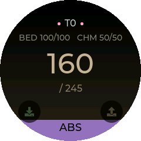
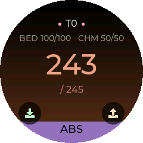
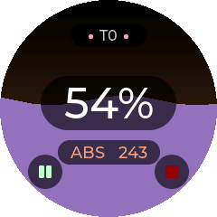
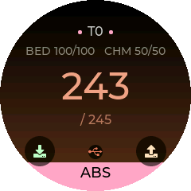
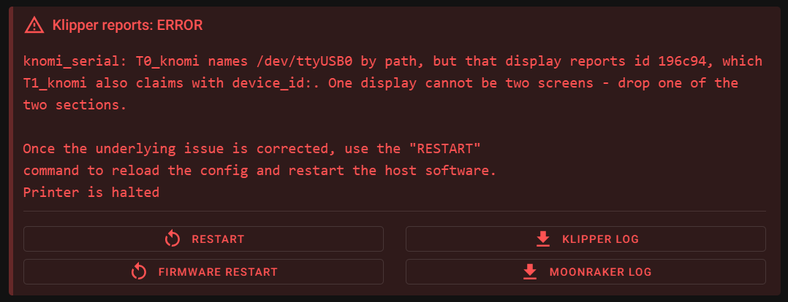

# Knomi_Serial

**Alternative firmware for the BTT Knomi V2 and similar round displays, which
replaces the network-reliant Moonraker connection with a direct serial link to
the Klipper host.**

No WiFi, no IP address, no Moonraker. The display is a USB device on the Klipper
machine, and a `klippy_extras` module talks to it directly.

| Waiting | Heating | Tool, at temperature | Printing | Shutdown |
| :---: | :---: | :---: | :---: | :---: |
|  |  |  |  |  |

<sup>Real captures off the glass — `python scripts/screenshot.py COM5 --all`.
Taken with the stock accent, `color_machine: FFA7C4`, against a `9572BF`
filament, so that the two are visibly not the same thing.</sup>

Colour carries three separate things and never mixes them.

**Filament** is whatever the slicer loaded — the purple above — and it is the
fill that rises with progress, its surface moving with the extruder so the
screen says the machine is *working* rather than merely part-way through. The
fill is the *only* progress indicator: a numeral saying the same thing spent the
largest element on the screen restating it, and on a toolchanger it restated a
property of the job as the biggest thing on a tool's screen.
**Heat** is a gradient behind everything, anchored to the target rather than to
a temperature: 60 °C on the way to 65 is nearly there, 60 °C on the way to 250
has barely started. The **machine's own accent** — the pink dots either side of
`T0`, and yours to change in `printer.cfg` — is reserved for chrome that is
about the printer rather than about the print.



Nothing in the protocol says goodbye, and a Klipper that is killed rather than
closed simply stops sending. Three seconds of silence and the display says so,
rather than holding its last frame indefinitely — a print that finished an hour
ago should not look like one at 55%. It keeps showing what it last heard,
because that is still the most useful thing on the glass; it just stops claiming
to be current, and lets the screen sleep on its normal timers again.

<br clear="right">

## Using it

The idle screen is a row of pages you **swipe** between horizontally. Which
pages, and in what order, is `pages:` in `printer.cfg`.

The **emergency stop hangs off that row vertically**, so it is one swipe from
every page rather than several along. `estop_at: bottom` (the default) means
drag up to reach it; `top` is the notification-shade gesture. It is never in
`pages:` and cannot be configured away.

The four corners are controls; see [the corner keys](#the-corner-keys).

## Scope, and what is finished

This fork is developed **toolchanger-first**: several displays on one printer,
one per tool, coordinated by a single Klipper module so that the state they
share is computed once rather than once per screen. That is the case the design
is worked out against.

Single-toolhead machines are supported by the same firmware, but they are the
secondary target and it shows: the `home` and `move` pages have not been brought
into the same design language as the rest. They work; they look like the
firmware this was forked from.

<table>
  <tr><th align="left">Area</th><th align="left">State</th></tr>
  <tr><td>Tool page</td><td rowspan="4">current design</td></tr>
  <tr><td>G-code page</td></tr>
  <tr><td>Printing screen</td></tr>
  <tr><td>Emergency stop page</td></tr>
  <tr><td>Home and move pages</td><td>inherited, not yet reworked</td></tr>
  <tr><td>Corner keys as touch targets</td><td>working</td></tr>
  <tr><td>Corner keys from the display's own GPIO</td><td>not implemented, <a href="#the-corner-keys">see below</a></td></tr>
</table>

## Installation

Plug the display into the Klipper host over USB — it enumerates as a CH340
serial port — then build and flash with [PlatformIO](https://platformio.org/):

```bash
pio run -e knomi -t upload
```

One firmware, whatever the machine. There used to be a separate toolchanger
build that compiled two pages out; it saved 1572 bytes of a 4.7 MB flash and
cost a second image to pick between, where flashing the wrong one silently
removed pages with nothing on screen to explain it.

The Klipper module is installed by running `install.sh` on the Klipper host. It
symlinks rather than copies, so `git pull` updates the module too. Add a config
section as below and restart Klipper.

## Klipper configuration

```ini
[knomi_serial T0_knomi]  # a named device like this, or a bare [knomi_serial]

device_id: 19aa44   # Which display this is. Six hex characters, case
                    # insensitive, shown on the display's own waiting screen
                    # and listed by `python scripts/discover.py`. See "Which
                    # display is which" below. Use this *or* `serial:`, not
                    # both.

tool:    # Which tool this screen belongs to, e.g. T0. Optional. It sets the
         # tag the screen shows, and lets KNOMI_TOOL address this screen by
         # tool number as well as by name. `T0`, `t0` and `0` are equivalent.

pages:   # Which pages the idle screen carries, in order, from
         # tool, gcode, home, move. The screen lands on the first, so this
         # chooses where you start as well as the sequence. A page that would
         # be empty is skipped - listing `gcode` with no `gcodes:` below gets
         # you no G-code page. The emergency stop is always last and is never
         # listed. Default: tool, gcode, home, move
         # A multi-screen setup may only want: pages: tool, gcode

# The screen shows a pair of accent dots either side of its tool tag when this
# is the extruder the toolhead currently has mounted - which is how you tell,
# at a glance across a row of displays, which one the machine is using. That is
# what heater_hotend does beyond temperature: it is matched against the active
# extruder's name, so it has to be the real extruder name (extruder, extruder1,
# ...) rather than any alias.
heater_hotend: extruder  # Name of the hotend heater.
heater_bed: heater_bed   # Name of the bed heater.

# Only one of heater_chamber and sensor_chamber should be configured.
heater_chamber:  # Name of the chamber heater.
sensor_chamber:  # Name of the chamber thermistor.

sensor_mcu:  # Name of an MCU temperature sensor. Reported in get_status.

move_x: 10  # Millimetres to move the toolhead in the positive X direction.
move_y: 10
move_z: 10

speed_x: 100  # Speed to move the toolhead in the X direction.
speed_y: 100
speed_z: 100

gcodes:  # Comma separated G-Codes to show on the G-code page.
```

### Which display is which

Every display carries a permanent id burned into its chip, and says it in the
status line it already sends every two seconds. Two ways to read it:

```sh
python scripts/discover.py            # a table of everything plugged in
python scripts/discover.py --config   # the same, as sections to paste
```

or just read it off the glass — it is on each display's waiting screen, under
the printer name. Case does not matter when you type it into `printer.cfg`.

Stop Klipper before running the script. Ports in use are locked with `flock`,
which Klipper, esptool and these scripts all take, so a port already being
driven is reported as busy rather than probed. The lock is advisory — it keeps
out the tools that ask for it, not a `cat /dev/ttyUSB0` — but it covers the case
that matters, which is two of these tools reaching for one display at once.

At startup the cluster listens on every port once, before any section opens
one, and refuses a config that describes one display twice — whether by two
`device_id:` sections, two `serial:` paths, or one of each:



That single pass is the only moment the two schemes can be checked against each
other, because once a `serial:` section holds its port nothing else can ask what
is on the end of it. Left to run, both sections would open the same port and
split its byte stream between them, so the symptom would be two screens blinking
out at random with nothing naming the cause.

Addressing by `device_id:` means the display keeps its identity whichever socket
it is in. That matters most on a toolchanger, where the failure it prevents is a
quiet one: swap two leads and two screens describe the wrong tools, with nothing
on either to say so.

**`serial:` still works** and is unchanged. If you use it, be aware of what a
path can and cannot promise here. The CH340K on these displays **reports no USB
serial number** — the descriptor is empty — so nothing on the USB side tells one
display from another, and every path names a *socket*:

| | two identical displays | move a cable | move a hub | replace a dead display |
| --- | --- | --- | --- | --- |
| `/dev/ttyUSB0` | swaps between reboots | swaps | swaps | keeps working |
| `/dev/serial/by-id/` | the `_1` suffix is assigned by the **kernel** in enumeration order, not by the device — so it can move too | swaps | swaps | keeps working |
| udev rule on `KERNELS==` | distinct | **swaps silently** | **all of them stop at once** | keeps working |
| `device_id:` | distinct | follows the display | follows the display | needs a one-line edit |

The two path failures are worth telling apart, because they feel nothing alike.
Swapping two leads on the same hub is the *quiet* one — two screens confidently
describe the wrong tools and nothing on either says so. Moving the hub itself is
loud but total: a rule keyed to `3-1.6.5` matches nothing once that hub enumerates
as `3-2`, so every display drops out together. The more USB tree you have above
the displays, the more ways there are for a position map to stop being true, and
the fragility scales with the size of the tree rather than the number of screens.

`device_id:` has one cost in exchange, and it is the last column: a hardware id
names *that display*, so replacing a dead one means editing the section that
referred to it. A position map does not care which unit is in the socket.

That is the actual choice — identity or position — rather than one being simply
better. A udev rule keyed to the physical USB port is the right tool when you
genuinely mean the socket, and is still fully supported:

```udev
# /etc/udev/rules.d/99-knomi.rules - one line per USB port on the hub
SUBSYSTEM=="tty", ATTRS{idVendor}=="1a86", KERNELS=="3-1.6.5", SYMLINK+="knomi_t0"
SUBSYSTEM=="tty", ATTRS{idVendor}=="1a86", KERNELS=="3-1.7.1", SYMLINK+="knomi_t1"
```

`install.sh` does not copy udev rules into place for you. Writing a rules file
is granting a device the right to appear under a name your config trusts, and
that is a decision to make deliberately rather than one a setup script should
make on your behalf.

### More than one screen

One section per display. They find each other and share a single set of timers
and one computation of the printer state, so a fourth screen costs a serial
write rather than a fourth pass over the machine:

```ini
[knomi_serial T0_knomi]
device_id: 19aa44
tool: T0
heater_hotend: extruder
heater_bed: heater_bed
pages: tool, gcode

[knomi_serial T1_knomi]
device_id: 19aa45
tool: T1
heater_hotend: extruder1
heater_bed: heater_bed
pages: tool, gcode
```

Bed and chamber only need declaring once — whichever section names them, every
screen shows them, because there is only one bed.

### Appearance and sleep

Every one of these is optional. Anything left out keeps the value the firmware
was compiled with in `src/user_conf.h` — setting one here **overrides** that
default rather than replacing the whole set.

```ini
color_machine:           # The printer's own accent, RRGGBB. Default FFA7C4.
color_filament_unknown:  # Shown when the host has not said what is loaded.
                         # Deliberately not black - unknown filament and black
                         # filament are different facts. Default 5A5A5A.
brightness:      # Backlight level, 0-16. Default 8.
dim_brightness:  # Level once dimmed. Default 3.
dim_time:        # Seconds idle before dimming. Default 30.
sleep_time:      # Seconds idle before the backlight goes out. Default 60.

estop_at:        # Which side of the page row the emergency stop hangs off,
                 # bottom or top. Bottom means swipe up to reach it, top means
                 # pull down. Default bottom.

readouts:        # Which secondary temperatures show above the hotend, in
                 # order, from bed, chamber, mcu. Each gets its own pill. One
                 # the machine does not have is skipped, so listing it costs
                 # nothing.
                 # Default: bed, chamber
                 # A toolchanger usually wants: readouts: mcu
                 # - the bed is the same on every screen, while the tool's own
                 #   MCU sits in the chamber and only that screen can report it.
```

These reach the device over the config channel, which it asks for whenever what
it holds stops matching what the host has. Editing them and restarting Klipper
is enough — there is nothing to reflash and nothing to power-cycle, and they
survive a reflash where the firmware's own defaults do not.
`printer["knomi_serial T0_knomi"].config_applied` says whether the screen is
actually running what was sent.

## The corner keys

Four controls sit on the diagonals, where a round layout has room to spare and
where physical keys can go. The lower pair is context-aware — load and unload on
the tool page, pause and cancel while printing — and the upper pair is reserved
for feed and retract, which on this machine are wired to the filament buffer and
work with the host down.

By default all four are **soft keys**: the glass is the button, and a bare
display needs no wiring to be fully usable.

```ini
hardware_keys: NW, NE   # any of NW NE SW SE, comma or space separated
```

Listing a corner keeps its symbol exactly where it is, as a **legend**, and
removes its touch target. Nothing on screen moves in that transition, which is
the point of putting the soft keys on the diagonals first — the positions are
learned before the hardware arrives.

**This option does not define pins.** It only tells the display to stop offering
an action that something else already reports. Where the pin is declared depends
on which board the switch is wired to:

- **To the Klipper host.** Declare it as a standard Klipper
  [`[gcode_button]`](https://www.klipper3d.org/Config_Reference.html#gcode_button)
  with its own `pin:` and `press_gcode:`. Klipper reads the switch; the display
  just stops duplicating it.
- **To the display itself.** Not implemented yet. Every free GPIO on the Knomi
  V2 sits behind the unpopulated U10 camera FPC, which needs a breakout before
  anything can be soldered — see [docs/hardware.md](docs/hardware.md) for the
  pin map, the four pins worth using, and the two that will bite you.

## Telling the screens about the job

```
KNOMI_TOOL [SCREEN=T0_knomi | TOOL=0] [USED=1] [COLOR=FF8800] [TYPE=PLA]
```

| Parameter | Value | If omitted |
| --- | --- | --- |
| `SCREEN` | Which screen, by section name — `[knomi_serial T0_knomi]` is `T0_knomi`, the way `[fan_generic my_fan]` is `my_fan`. | see below |
| `TOOL` | Which screen, by its `tool:` value. `T0`, `t0` and `0` are equivalent. May match several screens. | see below |
| `USED` | `0` or `1` — whether the running job uses this tool. Decides whether the screen sleeps. | Unchanged |
| `COLOR` | Filament colour as `RRGGBB`, leading `#` allowed. Empty clears it back to unknown. | Unchanged |
| `TYPE` | Material name, up to 15 characters. | Unchanged |

<sup>**Multi-screen** — give either `SCREEN=` or `TOOL=`, not both.<br>
**Single screen** — both are optional; there is nothing to disambiguate.</sup>

Both forms exist because two callers need different things. `SCREEN=` names the
object, the way Klipper does everywhere else, and is the only form that reaches
a section with no `tool:`. `TOOL=` is the only form a slicer can emit
generically — `TOOL={i}` sits in the same loop as `filament_colour[i]`, so the
macro writes itself — and it matches *every* screen declaring that tool, so a
spare display of one tool follows one spool.

Every parameter is optional, so one fact can be changed without restating the
others, and the command is safe to repeat. That makes mid-job reassignment
ordinary rather than a special case:

```gcode
# print start, one per tool - Orca knows all three from is_extruder_used[],
# filament_colour[] and filament_type[]
KNOMI_TOOL TOOL=0 USED=1 COLOR={filament_colour[0]} TYPE={filament_type[0]}

# T0 jammed, hand the rest of the job to T4
KNOMI_TOOL TOOL=0 USED=0
KNOMI_TOOL TOOL=4 USED=1 COLOR=FF0000 TYPE=ABS

# one display, no tool: declared - nothing to name
KNOMI_TOOL COLOR=9572BF TYPE=ABS
```

`USED` returns to true for every tool when a print ends, so the next job starts
clean, and it defaults to true on startup — a module restart mid-print must not
black out every screen. Filament colour and type deliberately survive a print
ending, because the spool is still in the tool.

### When a screen stays awake

A screen refuses to sleep while any of these hold:

- **`USED` is set and a job is running.** The host is *told* which tools a job
  uses rather than inferring it from nozzle temperature, because temperature
  cannot separate a docked tool still in the job from one merely warm from the
  chamber — with ooze prevention dropping a docked tool by 100 °C and a chamber
  at 60 °C, no threshold splits those two.
- **Klipper has shut down**, because a dark screen cannot report a fault.
- **The nozzle is hotter than `SLEEP_HOT_THRESHOLD`.** A compile-time safety net
  in `src/user_conf.h` — not a `printer.cfg` option and not a `KNOMI_TOOL`
  parameter — so a hot nozzle keeps its screen lit whatever the host believes.
  Defaults to 80 °C, and must sit **above chamber temperature** or a tool idling
  at chamber heat reads as busy and the screen never sleeps at all.

All three are claims about the machine, so a link that has gone quiet stops
making them and the normal timers resume.

## Status reference

The device reports its own state back over the same serial link every two
seconds (`REPORT_PERIOD_MS` in `src/user_conf.h`), so it is available to macros
and to the Moonraker API as `printer["knomi_serial T0_knomi"]` (or
`printer.knomi_serial` for an unnamed section):

| Field | Description |
| --- | --- |
| `connected` | Host has the serial port open. |
| `port` | Configured serial path. |
| `module_version` | Version of this Klipper module. |
| `protocol_version` | Wire format version this module speaks. |
| `config_crc` | CRC32 of the config this module is holding. |
| `screen_name` | What `KNOMI_TOOL SCREEN=` addresses this section as. |
| `tool` | Normalised `tool:` value, e.g. `0`. `None` if unset. |
| `used` | Whether the running job uses this tool. |
| `filament_color` | Loaded filament colour as `RRGGBB`, or `None`. |
| `filament_type` | Loaded material name, or `None`. |
| `device_online` | Device has reported within the last 10 seconds. |
| `report_age` | Seconds since the last report, or `None`. |
| `firmware_version` | Version actually flashed on the device. |
| `device_protocol_version` | Wire format version the device speaks. |
| `protocol_match` | Whether the two protocol versions agree. |
| `device_config_crc` | CRC32 of the config the device is actually running. |
| `config_applied` | Whether the device is running what was sent. |
| `build_variant` | Which PlatformIO env was flashed. |
| `sleep_state` | `awake`, `dim`, or `off`. |
| `screen` | `init`, `idle`, `printing`, or `shutdown`. |
| `page` | Index of the idle screen page in view. |
| `page_count` | How many pages the screen built, after empty ones were skipped. |
| `free_heap` / `min_free_heap` | Current and lowest-ever free heap, bytes. |
| `device_uptime` | Seconds since the device booted. |

Every device-side field is `None` until the first report arrives, so a device
running firmware older than this feature reads as `device_online: False` with a
`None` version.

## Testing the display without printing

`scripts/simulate.py` drives a display with made-up state over USB, so UI work
does not need a printer — or even Klipper. It builds packets with
`knomi_serial.encode_state`, the same encoder the module uses, so the screen
sees byte-for-byte what it sees in service, and it answers the commands the
display sends back so the buttons actually do things.

```bash
pip install pyserial

python scripts/simulate.py --list                    # find the port
python scripts/simulate.py COM7                      # loop a whole fake print
python scripts/simulate.py COM7 --progress 54        # park the fill mid-screen
python scripts/simulate.py COM7 --cycle-colours      # step through filaments
python scripts/simulate.py COM7 --no-used            # should dim, then sleep
```

With nothing pinned it loops cold → heating → printing 0–100% → finished,
ramping temperatures rather than jumping them so the heat colour visibly crosses
steel to amber. Pin any value and it stops moving: `--progress 54` parks the
fill right at the ink crossover, which is where black-versus-white text is worth
checking against a real panel.

`--cycle-colours` walks the presets, which deliberately include the awkward
cases — white and yellow, where the ink must flip to black; true black, where it
must not; and a pink close enough to the machine accent to check identity
survives it.

**Stop Klipper first** if the display is wired to a running host. Both would be
writing to the same port and the screen would see interleaved packets.

### Screenshots

Every image in this README is a real capture pulled off the glass over the same
serial link — the display has no network, no filesystem and no second port.

```bash
python scripts/screenshot.py COM5 --drive printing -o docs/img/printing.png
python scripts/screenshot.py COM5 -o now.png     # whatever is on screen now
```

About fourteen seconds a frame. `--drive` feeds the display a state first, so a
documentation shot does not depend on catching the printer in the right mood.
See [docs/protocol.md](docs/protocol.md) for how it works.

### Checks

```bash
pip install -r requirements-dev.txt

python tests/test_protocol.py     # firmware and module agree about the wire
python tests/test_addressing.py   # which screen a KNOMI_TOOL lands on
ruff check .                      # Python lint
pio run -e knomi
```

All of these run in CI on every push and pull request, as three jobs. The protocol test is the one
worth having: the firmware's `static_assert`s pin the packet layout, but only
against other C++, and nothing else compares it against the Python that has to
produce those bytes. A field added to `struct State` without a matching change
to `_STATE_FMT` compiles clean, installs clean, and produces a display reading
every field from the wrong offset. The test reads the constants out of
`printer.h` and fails if the two sides have drifted.

The addressing test covers rules that read as obvious and are not: a command
with no target is correct on one machine and ambiguous on the next, and `TOOL=`
is a one-to-many lookup.

## Versioning

The canonical version is the `VERSION` file at the repo root. `scripts/version.py`
runs before each build and compiles it into the firmware, appending semver build
metadata when the tree is not a clean release build:

```
0.4.0                    clean tree, tagged v0.4.0
0.4.0+3.gd34db33         3 commits past the tag
0.4.0+3.gd34db33.dirty   ...with uncommitted changes
0.4.0+gd34db33           no matching tag
```

The Klipper module reads the same `VERSION` file, which works because
`install.sh` symlinks it into `klippy/extras` rather than copying it.

To cut a release: bump `VERSION`, commit, then `git tag -a v0.4.0 -m 0.4.0`.
Moonraker's update manager infers the repo version from that tag on its own — it
needs at least one tag in `vX.Y.Z` form, and no manifest file in this repo.
Comparing the tag Moonraker reports against `firmware_version` above is what
tells you the device is due a reflash.

### Moonraker

In `moonraker.conf`, to get this into the update panel:

```ini
[update_manager knomi_serial]
type: git_repo
path: ~/knomi_serial
origin: https://github.com/Vylyne/knomi_serial.git
primary_branch: main
managed_services: klipper knomi_serial
```

`managed_services` is what Moonraker restarts after pulling. `klipper` because
the module is symlinked into `klippy/extras` and only reloads on restart; drop
`knomi_serial` from the list if you are not running the watcher service.

Moonraker will only control services named in its allowlist, so add the watcher
to `~/printer_data/moonraker.asvc` as well:

```
knomi_serial
```

Nothing here is a Moonraker *agent*. The watcher opens no sockets and exchanges
no events — it writes a file, and Klipper reads it. Making it an agent would
mean it could only work while Moonraker was up, which is the opposite of the
point: see [service/README.md](service/README.md).

`printer::kProtoVersion` (`src/printer/printer.h`) and `_PROTO_VERSION`
(`klippy_extras/knomi_serial.py`) are separate from the release version and are
bumped only when a wire format changes. A mismatch is logged once to
`klippy.log` and surfaced as `protocol_match: False`.
[docs/protocol.md](docs/protocol.md) describes the wire format;
`tests/test_protocol.py` fails the build if the two sides disagree about it.

## Acknowledgements

- **[Klipper](https://www.klipper3d.org/)**, by Kevin O'Connor and its
  contributors. This firmware is a client of it and would have nothing to
  display without it. The Klipper module here follows its `klippy_extras`
  conventions throughout.
- **[ruiqimao/zerod](https://github.com/ruiqimao/zerod)**, which this is a fork
  of, and which established the serial-instead-of-Moonraker approach the whole
  project rests on.
- **[BIGTREETECH](https://github.com/bigtreetech/Knomi-V2)** for the Knomi V2
  hardware and for publishing its schematic, without which
  [docs/hardware.md](docs/hardware.md) would be guesswork.
- **[LVGL](https://lvgl.io/)** and
  **[TFT_eSPI](https://github.com/Bodmer/TFT_eSPI)**, which do the drawing.
